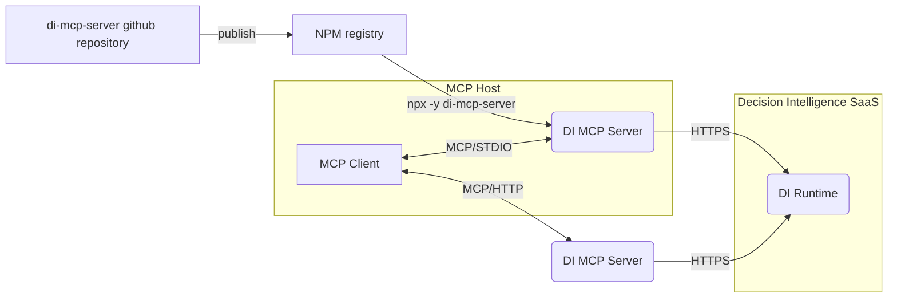

# MCP server for IBM Decision Intelligence

[](https://github.com/DecisionsDev/di-mcp-server/actions/workflows/build.yml) [](LICENSE) [](https://www.npmjs.com/package/di-mcp-server) 


A Model Context Protocol (MCP) server empowers AI assistants by accessing decisions from IBM Decision Intelligence.

The MCP server is available as an npm package in the free npm registry at https://www.npmjs.com/package/di-mcp-server.

It supports both STDIO and streamable HTTP transports for local or remote deployments for supporting any MCP clients.


<a id="getting_started"></a>
## Getting started with the MCP server
You can use the MCP server available in the npm registry. If you want to develop your own MCP server or contribute to the development, see [Developing the MCP server](#developing).

You can run the MCP server with `npx` to expose as MCP tools the operations of the last deployed version of all decision services:

```bash
npx -y di-mcp-server --apikey <APIKEY> --url <RUNTIME_BASE_URL> --transport <TRANSPORT> --runtime <RUNTIME>
```

where
- `APIKEY` is the API key to access the decision runtime.
- `RUNTIME_BASE_URL` is the base URL of the decision runtime REST API. Its pattern is: `https://<TENANT_NAME>.decision-prod-us-south.decision.saas.ibm.com/ads/runtime/api/v1` where TENANT_NAME is the name of the tenant.
- `TRANSPORT` is either `STDIO` (default) or `HTTP`.
- `RUNTIME` is either `DI` (default) for using the decision runtime of Decision Intelligence or `ADS` for using the decision runtime of Cloud Pak for Business Automation or Automation Decision Services.


Example:

```bash
npx -y di-mcp-server --apikey HRJcDNlNXZVWlk9 --url https://mytenant.decision-prod-us-south.decision.saas.ibm.com/ads/runtime/api/v1
```

<a id="ai_applications"></a>
## Integrating decision services into AI applications

The MCP server for Decision Intelligence extends its capability by enabling AI applications, such as IBM watsonx Orchestrate and Claude, to discover and execute deployed decision services.

### Integrating decision services into IBM watsonx Orchestrate

You can integrate decision services into IBM watsonx Orchestrate by adding the MCP server.

1. In the agent builder, click **Add tool**.

   

2. Click **Import**, and then click **Import from MCP server**.

   

3. Click **Add MCP server**

   

4. Specify the name for the server and the `npx` command that is explained in the Getting started section.

   

5. Close the dialog box, and select the tool that you want to add to your agent.

   

   Your agent is now empowered with decisions.

### Integrating decision services into Claude Desktop

You can integrate decision services into Claude Desktop by adding the MCP server.

1. Locate the Claude Desktop configuration file.

   Find your Claude configuration directory:
   - **macOS**: `~/Library/Application\ Support/Claude/claude_desktop_config.json`
   - **Windows**: `%APPDATA%\Claude\claude_desktop_config.json`
   - **Linux**: `${HOME}/.config/Claude/claude_desktop_config.json`


2. Add the MCP server configuration to the configuration file.

   In the configuration directory, edit or create `claude_desktop_config.json`:

```json
{
    [..]
    "mcpServers": {
        "di-mcp-server": {
            "command": "npx",
            "args": [
                "-y",
                "di-mcp-server",
                "--apikey",
                "<APIKEY>",
                "--url",
                "https://<TENANT_NAME>.decision-prod-us-south.decision.saas.ibm.com/ads/runtime/api/v1"
            ]
        }
    }
    [..]
}
```

For more information, see https://modelcontextprotocol.io/quickstart/user.

<a id="developing"></a>
## Developing the MCP server

You can develop your own MCP server by using the source files that are available here.

### Getting source files

Run the following command to get the source files of the MCP server:

```bash
git clone https://github.com/DecisionsDev/di-mcp-server.git
cd di-mcp-server
```

### Building the MCP server

Run the following commands to build the MCP server from the source files:

```bash
npm install
npm run build
```

### Testing the MCP server

Run the following command to test the MCP server:

```bash
npm test
```
### Running the MCP server in development mode with `nodemon`

Run the MCP server with `nodemon` and the `DEBUG` environment variable:
- The server is restarted whenever changes are detected on the source code.
- Debug output is enabled.

#### Using command line options
```bash
npm run dev -- --apikey <APIKEY> --url <URL>
```
#### Using environment variables
```bash
APIKEY=<APIKEY> URL=<URL> npm run dev
```

## Environment variables

| Name             | Description                                                                                |
|------------------|--------------------------------------------------------------------------------------------|
| APIKEY           | API key to access the decision runtime.                                                     |
| DEBUG            | When the value is `true`, the debug messages are written to the `stderr` of the MCP server. |
| RUNTIME          | The target decision runtime: `DI` (default) or `ADS`.                                       |
| TRANSPORT        | The transport protocol: `STDIO` (default) or `HTTP`.                                        |
| URL              | Base URL of the decision runtime                                                           |

## License
[Apache 2.0](LICENSE)

## Notice

© Copyright IBM Corporation 2025.