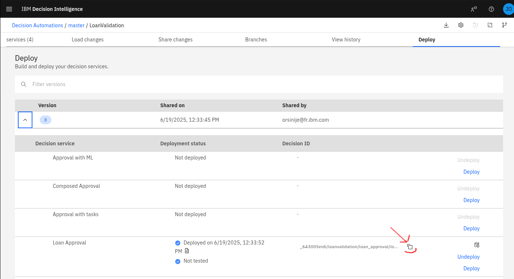

# MCP Server for IBM Decision Intelligence

A Model Context Protocol server enabling AI assistant to access the decision
from IBM Decision Intelligence.

```diagram
```

## Getting started

The MCP server is available as a NPM package in the free NPM registry: https://www.npmjs.com/package/di-mcp-server.

It can be easily ran with `npx` to expose all operations of a given decision as tools:

```
npx -y mcp-server <APIKEY> <DECISION_RUNTIME_BASEURL> <DECISION_ID>
```

Where:

- APIKEY: is the API key to access the Decision Runtime
- DECISION_RUNTIME_BASEURL: is the baseurl of the REST API of the Decision Runtime. The pattern is: https://<TENANT_NAME>.decision-dev-us-south.decision.saas.ibm.com/ads/runtime/api/v1 where TENANT_NAME is the name of the tenant
- DECISION_ID: is the decision id of the decision

The decision id can be retrieved from the deploy panel of the decision UI:



Example:

```
npx -y di-mcp-server azI6ZTViZDAAJDNMAtMDA1OS00NzVkLTg0YTctOGNiNzRkZjJmNzkyOlpnUHNMb0VCb0tBcDBsSnZhdTZXLy96N3ppWEwxM2Z4WHRJcDNlNXZVWlk9 https://ibm.decision-dev-us-south.decision.saas.ibm.com/ads/runtime/api/v1 _643005eidi/loanvalidation/loan_approval/loanApprovalDecisionService/3-2025-06-19T10:33:52.182Z
```

## IBM Watson Orchestrate

In the agent builder, click 'Add tool'


Click import, then click import from mcp server


Click add MCP server


Specify a name for the server and the `npx` command already explained in the previous getting started section.


Close the dialog box and select the tool that you want to add to your agent


That's it, your agent is now empowered with decisions!

## Claude Desktop

In the Claude configuration directory, edit (or create it if does not exist) the file `claude_desktop_config.json` and add an entry to specify the MCP server:

```json
{
    "mcpServers": {
        "di-mcp-server": {
            "command": "npx",
            "args": [
                "-y",
                "di-mcp-server",
                "<APIKEY>",
                "https://<TENANT_NAME>.decision-dev-us-south.decision.saas.ibm.com/ads/runtime/api/v1",
                "<DECISION_ID>"
            ]
        }
    }
}
```

The location of Claude configuration directory depends on your OS:

- macOS: `~/Library/Application\ Support/Claude/claude_desktop_config.json`
- Windows: `%APPDATA%\Claude\claude_desktop_config.json`
- Linux: `${HOME}/.config/Claude`

More information at https://modelcontextprotocol.io/quickstart/user.

## License
[Apache 2.0](LICENSE)

## Notice

© Copyright IBM Corporation 2025.