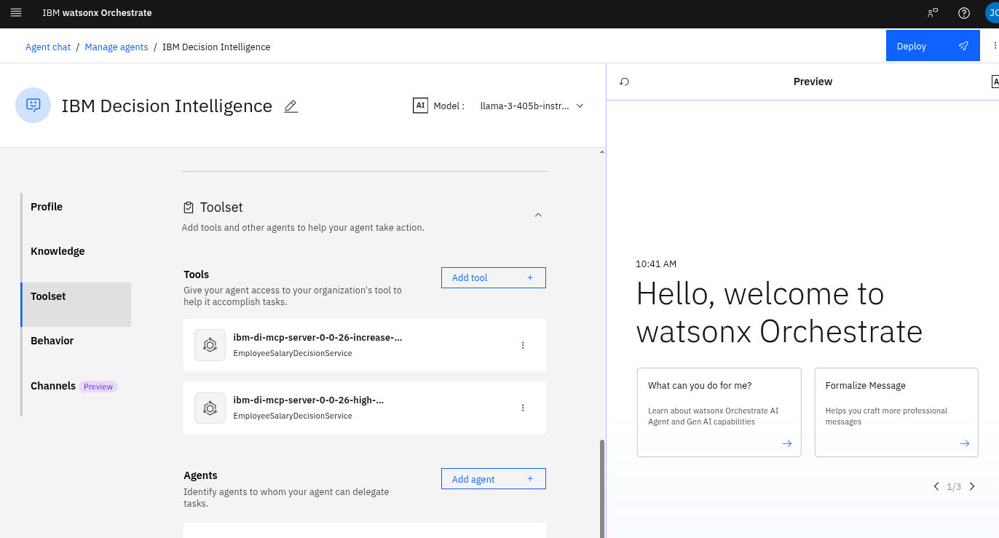
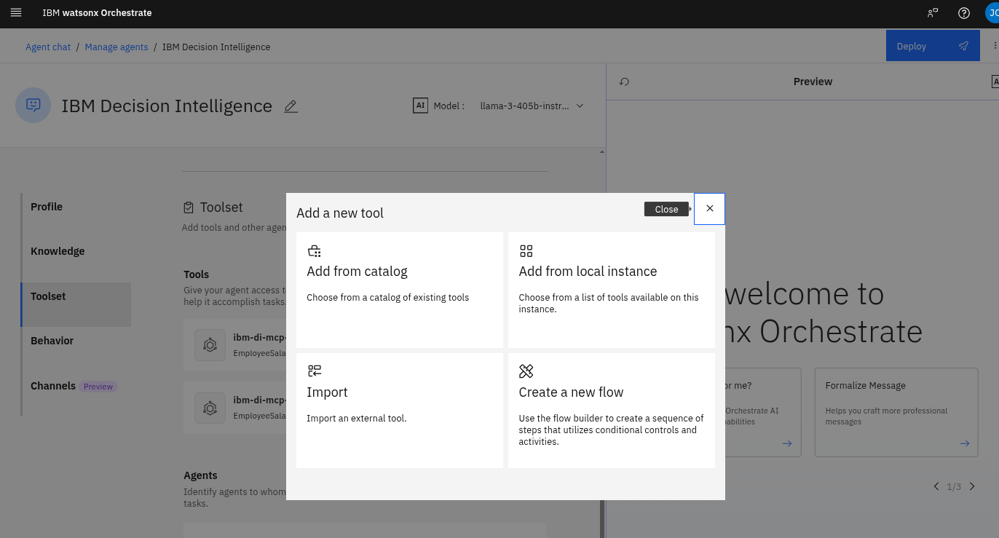
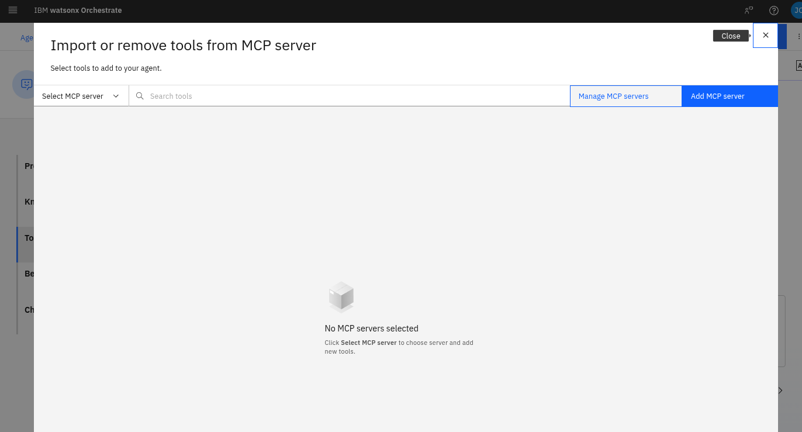
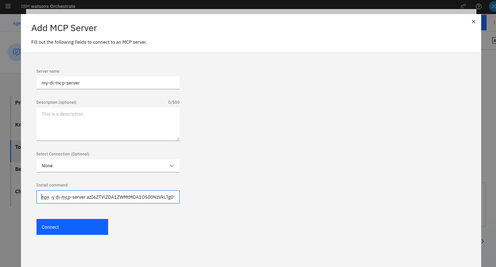
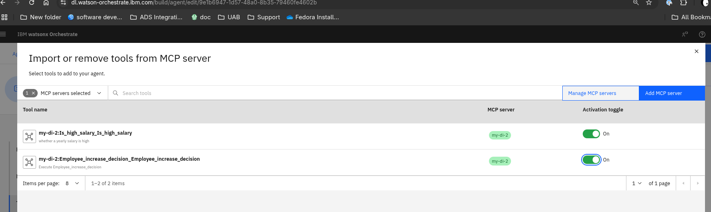

# MCP Server for IBM Decision Intelligence

[](https://github.com/DecisionsDev/di-mcp-server/actions/workflows/build.yml)

](https://github.com/DecisionsDev/di-mcp-server)

[](https://github.com/DecisionsDev/di-mcp-server/releases) [](LICENSE)


A Model Context Protocol server enabling AI assistant to access the decisions
from IBM Decision Intelligence.

```mermaid
block-beta
    
    block:MCP_HOST
        client space:1 server
    end

    client["MCP Client"] --"mcp/stdio"--> server["Decision Intelligence MCP Server"]

    server space:1 runtime
    server --"https"--> runtime["Decision Intelligence Runtime"]   

    runtime
```



## Getting started

The MCP server is available as a NPM package in the free NPM registry: https://www.npmjs.com/package/di-mcp-server.

It supports both STDIO and HTTP Streamable transports for local or remote deployments to support any MCP clients.

It can be easily ran with `npx` to expose the operations of the last deployed version of all decisions as MCP tools:

```
npx -y mcp-server <APIKEY> <DECISION_RUNTIME_BASEURL> <STDIO|HTTP>
```

Where:

- APIKEY: is the API key to access the Decision Runtime
- DECISION_RUNTIME_BASEURL: is the baseurl of the REST API of the Decision Runtime. The pattern is: https://<TENANT_NAME>.decision-dev-us-south.decision.saas.ibm.com/ads/runtime/api/v1 where TENANT_NAME is the name of the tenant


Example:

```
npx -y di-mcp-server azI6ZTViZDAAJDNMAtMDA1OS00NzVkLTg0YTctOGNiNzRkZjJmNzkyOlpnUHNMb0VCb0tBcDBsSnZhdTZXLy96N3ppWEwxM2Z4WHRJcDNlNXZVWlk9 https://ibm.decision-dev-us-south.decision.saas.ibm.com/ads/runtime/api/v1 STDIO
```

## IBM Watson Orchestrate

In the agent builder, click 'Add tool'



Click import, then click import from mcp server



Click add MCP server



Specify a name for the server and the `npx` command already explained in the previous getting started section.



Close the dialog box and select the tool that you want to add to your agent



That's it, your agent is now empowered with decisions!

## Claude Desktop

In the Claude configuration directory, edit (or create it if does not exist) the file `claude_desktop_config.json` and add an entry to specify the MCP server:

```json
{
    "mcpServers": {
        "di-mcp-server": {
            "command": "npx",
            "args": [
                "-y",
                "di-mcp-server",
                "<APIKEY>",
                "https://<TENANT_NAME>.decision-dev-us-south.decision.saas.ibm.com/ads/runtime/api/v1",
                "STDIO"
            ]
        }
    }
}
```

The location of Claude configuration directory depends on your OS:

- macOS: `~/Library/Application\ Support/Claude/claude_desktop_config.json`
- Windows: `%APPDATA%\Claude\claude_desktop_config.json`
- Linux: `${HOME}/.config/Claude`

More information at https://modelcontextprotocol.io/quickstart/user.

## License
[Apache 2.0](LICENSE)

## Notice

© Copyright IBM Corporation 2025.
