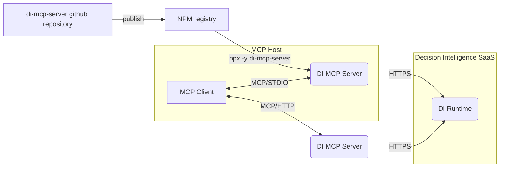

# MCP Server for IBM Decision Intelligence

[](https://github.com/DecisionsDev/di-mcp-server/actions/workflows/build.yml) [](LICENSE) [](https://www.npmjs.com/package/di-mcp-server)


A Model Context Protocol (MCP) server that empowers AI assistants with access to the decisions from the IBM Decision Intelligence SaaS service.

The MCP server is available as a NPM package in the free NPM registry: https://www.npmjs.com/package/di-mcp-server.

It supports both STDIO and HTTP Streamable transports for local or remote deployments in order to support any MCP clients.



## Getting started


The MCP server can be easily ran with `npx` to expose as MCP tools the operations of the last deployed version of all decision services:

```bash
npx -y di-mcp-server --apikey <APIKEY> --url <RUNTIME_BASE_URL> --transport <TRANSPORT> --runtime <RUNTIME>
```

Where:
- `APIKEY` is the API key to access the Decision Runtime
- `RUNTIME_BASE_URL` is the base URL of the Decision Runtime REST API. Its pattern is: `https://<TENANT_NAME>.decision-prod-us-south.decision.saas.ibm.com/ads/runtime/api/v1` where TENANT_NAME is the name of the tenant
- `TRANSPORT` is either `STDIO` (default) or `HTTP`
- `RUNTIME` is either `DI` (default value) when using the Decision Runtime of Decision Intelligence or `ADS` when using the Decision Runtime of CP4BA/ADS.


Example:

```bash
npx -y di-mcp-server --apikey HRJcDNlNXZVWlk9 --url https://mytenant.decision-prod-us-south.decision.saas.ibm.com/ads/runtime/api/v1
```

## Integration Guides

### IBM Watson Orchestrate

In the agent builder, click 'Add tool'


Click import, then click import from mcp server


Click add MCP server


Specify a name for the server and the `npx` command already explained in the previous getting started section.


Close the dialog box and select the tool that you want to add to your agent


That's it, your agent is now empowered with decisions!

### Claude Desktop

1. Locate Configuration File
   
   Find your Claude configuration directory:
   - **macOS**: `~/Library/Application\ Support/Claude/claude_desktop_config.json`
   - **Windows**: `%APPDATA%\Claude\claude_desktop_config.json`
   - **Linux**: `${HOME}/.config/Claude/claude_desktop_config.json`


2. **Add MCP Server Configuration**

In the configuration directory, edit or create `claude_desktop_config.json`:

```json
{
    [..]
    "mcpServers": {
        "di-mcp-server": {
            "command": "npx",
            "args": [
                "-y",
                "di-mcp-server",
                "--apikey",
                "<APIKEY>",
                "--url",
                "https://<TENANT_NAME>.decision-prod-us-south.decision.saas.ibm.com/ads/runtime/api/v1"
            ]
        }
    }
    [..]
}
```

More information at https://modelcontextprotocol.io/quickstart/user.

## Development

### Get sources

```bash
git clone https://github.com/DecisionsDev/di-mcp-server.git
cd di-mcp-server
```

### Building from Source

```bash
npm install
npm run build
```

### Run tests

```bash
npm test
```
### Running server in development mode with nodemon
This will run `nodemon` with the `DEBUG` environment variable:
 - The server is restarted whenever changes are detected on the source code
 - Debug output is enabled
 
#### Using command line options
```bash
npm run dev -- --apikey <APIKEY> --url <URL>
```
#### Using environment variables
```bash
APIKEY=<APIKEY> URL=<URL> npm run dev
```

## Environment variables

| Name             | Description                                                                                |
|------------------|--------------------------------------------------------------------------------------------|
| APIKEY           | API key to access the Decision Runtime                                                     |
| DEBUG            | When the value is `true`, the debug messages are written to the 'stderr' of the MCP server |
| RUNTIME | The target Decision Runtime; `DI` (default) or `ADS`                                       
| TRANSPORT        | The transport protocol; `STDIO` (default) or `HTTP`                                        |
| URL              | Base URL of the Decision Runtime                                                           |

## License
[Apache 2.0](LICENSE)

## Notice

© Copyright IBM Corporation 2025.
