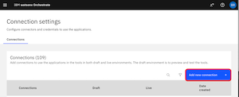

# MCP server for IBM Decision Intelligence

[](https://github.com/DecisionsDev/di-mcp-server/actions/workflows/build.yml) [](LICENSE) [](https://www.npmjs.com/package/di-mcp-server) 

This Model Context Protocol (MCP) server empowers AI assistants by accessing decisions from IBM Decision Intelligence.

The MCP server is available as an npm package in the free npm registry at https://www.npmjs.com/package/di-mcp-server.

It supports both STDIO and streamable HTTP transports for local or remote deployments for supporting any MCP clients.


<a id="getting_started"></a>
## Getting started with the MCP server
You can use the MCP server available in the npm registry. If you want to develop your own MCP server or contribute to the development, see [Developing the MCP server](#developing).

You can run the MCP server with `npx` to expose as MCP tools the operations of the last deployed version of all decision services:

```bash
npx -y di-mcp-server --apikey <APIKEY> --url <RUNTIME_BASE_URL> --transport <TRANSPORT> --runtime <RUNTIME>
```

where
- `APIKEY` is the API key to access the decision runtime.
- `RUNTIME_BASE_URL` is the base URL of the decision runtime REST API. Its pattern is: `https://<TENANT_NAME>.decision-prod-us-south.decision.saas.ibm.com/ads/runtime/api/v1` where TENANT_NAME is the name of the tenant.
- `TRANSPORT` is either `STDIO` (default) or `HTTP`.
- `RUNTIME` is either `DI` (default) for using the decision runtime of Decision Intelligence or `ADS` for using the decision runtime of Cloud Pak for Business Automation or Automation Decision Services.


Example:

```bash
npx -y di-mcp-server --apikey HRJcDNlNXZVWlk9 --url https://mytenant.decision-prod-us-south.decision.saas.ibm.com/ads/runtime/api/v1
```

<a id="ai_applications"></a>
## Integrating decision services into AI applications

The MCP server for Decision Intelligence extends its capability by enabling AI applications, such as IBM watsonx Orchestrate and Claude, to discover and execute deployed decision services.

### Integrating decision services into IBM watsonx Orchestrate

You can integrate decision services into IBM watsonx Orchestrate by adding the MCP server.

1. In the agent builder, click **Add tool**.

   [](doc/wo1.png)

2. Click **Import**

   [](doc/wo2.png)

3. Then click **Import from mcp server**

   [](doc/wo3.png)

4. Click **Add MCP server**

   [](doc/wo4.png)

5. Specify the name for the server and the `npx` command that is explained in the Getting started section.

   [](doc/wo5.png)

6. Close the dialog box, and select the tool that you want to add to your agent.

   [](doc/wo6.png)

   Your agent is now empowered with decisions.

#### Use a connection to specify the APIKEY and URL environment variables

1. Open the main menu, then click **Manage**, then click **Connections**, to open the Connection settings

   [](doc/wxO-connection-01.png)

2. Click **Add new connection** to launch the **Add new connection** wizard

   [](doc/wxO-connection-02.png)

3. Fill in the **Connection ID** and **Display name** fields, then click **Save and continue**

   [](doc/wxO-connection-03.png)

4. In the **Configure draft connection** panel:
   - Select **Key Value Pair** as **Authentication Type**
   - Fill-in the **Key** and **Value** fields to define the `APIKEY` environment variable
   - Then click **Add key value pair**

   [](doc/wxO-connection-04.png)

5. Fill-in the **Key** and **Value** fields to define the `URL` environment variable, then click **Connect**

   [](doc/wxO-connection-05.png)

6. When the draft connection is connected, click **Next**

   [](doc/wxO-connection-06.png)

7. Similarly configure the live connection, then click **Add connection**

   [](doc/wxO-connection-07.png)

8. In the **Add MCP Server** wizard:
   - Select the display name corresponding to the connection you just configured
   - Fill-in the `npx` command **WITHOUT** the `--apikey` and `--url` arguments
   - Click **Connect** then **Done**

    [](doc/wxO-connection-08.png)

### Integrating decision services into Claude Desktop

You can integrate decision services into Claude Desktop by adding the MCP server.

1. Locate the Claude Desktop configuration file.

   Find your Claude configuration directory:
   - **macOS**: `~/Library/Application\ Support/Claude/claude_desktop_config.json`
   - **Windows**: `%APPDATA%\Claude\claude_desktop_config.json`
   - **Linux**: `${HOME}/.config/Claude/claude_desktop_config.json`


2. Add the MCP server configuration to the configuration file.

   - In the configuration directory, edit or create `claude_desktop_config.json`:

      ```json
      {
          [..]
          "mcpServers": {
              "di-mcp-server": {
                  "command": "npx",
                  "args": [
                      "-y",
                      "di-mcp-server",
                      "--apikey",
                      "<APIKEY>",
                      "--url",
                      "https://<TENANT_NAME>.decision-prod-us-south.decision.saas.ibm.com/ads/runtime/api/v1"
                  ]
              }
          }
          [..]
      }
      ```
   - Alternatively, you can use the `APIKEY` and `URL` environment variables to respectively specify the API key and the base URL of the decision runtime REST API:

      ```json
      {
          [..]
          "mcpServers": {
              "di-mcp-server": {
                  "command": "npx",
                  "args": ["-y", "di-mcp-server"],
                  "env": {
                      "APIKEY": "<APIKEY>",
                      "URL": "https://<TENANT_NAME>.decision-prod-us-south.decision.saas.ibm.com/ads/runtime/api/v1"
                  }
              }
          }
          [..]
      }
      ```

For more information, see https://modelcontextprotocol.io/quickstart/user.

### Integrating decision services into Cursor

1. In Cursor, click the cog wheel icon to open Cursor settings

2. Click **Tools & Integration** in the setting categories listed on the left-hand side

   [](doc/cursor1.png)

3. Click **+ New MCP Server**, this will open Cursor's `mcp.json` configuration file

   [](doc/cursor2.png)

4. Add a new MCP server entry.
As for Claude Desktop, you can specify the API key and base URL of the decision runtime REST API using:
   - Either command line arguments:
      ```json
      {
          [..]
          "mcpServers": {
              "di-mcp-server": {
                  "command": "npx",
                  "args": [
                      "-y",
                      "di-mcp-server",
                      "--apikey",
                      "<APIKEY>",
                      "--url",
                      "https://<TENANT_NAME>.decision-prod-us-south.decision.saas.ibm.com/ads/runtime/api/v1"
                  ]
              }
          }
          [..]
      }
      ```
   - Or environment variables: 
      ```json
      {
          [..]
          "mcpServers": {
              "di-mcp-server": {
                  "command": "npx",
                  "args": ["-y", "di-mcp-server"],
                  "env": {
                      "APIKEY": "<APIKEY>",
                      "URL": "https://<TENANT_NAME>.decision-prod-us-south.decision.saas.ibm.com/ads/runtime/api/v1"
                  }
              }
          }
          [..]
      }
      ```

For more information, see Cursor's documentation about [_Installing MCP servers_](https://docs.cursor.com/en/context/mcp#installing-mcp-servers).

### Using Custom Tool Names for Decision Intelligence

When integrating Decision Intelligence with AI tools, you may need to customize the tool names to meet specific requirements or limitations of the target platform, such as:

- Maximum length restrictions
- Forbidden characters
- Naming conventions

#### Default Tool Naming Algorithm

By default, tool names are generated as follows:
1. Combines the decision service name with the operation ID: `decisionServiceName operationID`
2. Replaces spaces and forward slashes with underscores: `decisionServiceName_operationID`
3. Handles name collisions by using the decision service ID: use `decisionServiceID_operationID` if `decisionServiceName_operationID` already exists 

#### Customizing Tool Names with the Decision Intelligence REST API

If the default naming doesn't meet your requirements, you can set custom tool names using decision metadata:

##### Either directly

With a command-line tool like `curl`, or a browser extension like `Postman`, you can set the `mcpToolName.<OPERATION_ID>` metadata property for any operation:

```bash
curl -X 'PUT' \
  'https://<TENANT_NAME>.decision-prod-us-south.decision.saas.ibm.com/ads/runtime/api/v1/deploymentSpaces/development/decisions/DECISION_ID/metadata' \
  -H 'accept: */*' \
  -H 'Authorization: apikey YOUR_API_KEY' \
  -H 'Content-Type: application/json' \
  -d '{
  "map": {
    "mcpToolName.OPERATION_ID": {
      "name": "mcpToolName.OPERATION_ID",
      "kind": "PLAIN",
      "readOnly": false,
      "value": "YourCustomToolName"
    }
  }
}'
```
where
- `TENANT_NAME` is the name of the tenant.
- `DECISION_ID` is the decision's unique identifier
- `DI_API_KEY` is the Decision Intelligence API key
- `OPERATION_ID` is the operation unique identifier
- `YourCustomToolName` is the desired tool name

##### Or with Swagger UI

Alternatively, you can also use the Decision Intelligence REST API Swagger UI to update the tool name:
1. Access the Decision Intelligence REST API Swagger UI by navigating to the URL of your Decision Manager instance (`https://<TENANT_NAME>.decision-prod-us-south.decision.saas.ibm.com/ads/runtime/api/swagger-ui/#`)
2. Find the PUT endpoint for /deploymentSpaces/{deploymentSpaceId}/decisions/{decisionId}/metadata, expand it, click **Try it out**
3. Click the **lock icon** to Authorize the request with the DI API key
4. Fill in the required parameters:
   - `deploymentSpaceId`: `development`
   - `decisionId`: the decision's unique identifier
   - In the request body, provide the metadata JSON as illustrated below
      ```json
      {
        "map": {
          "mcpToolName.OPERATION_ID": {
            "name": "mcpToolName.OPERATION_ID",
            "kind": "PLAIN",
            "readOnly": false,
            "value": "YourCustomToolName"
          }
        }
      }
     ```
   [](doc/di-rest-api.png)
5. Execute the request


#### Best Practices for Custom Tool Names

When creating custom tool names, consider these best practices:

1. **Keep names concise**: Shorter names are easier to remember and use
2. **Use consistent patterns**: Apply the same naming convention across all tools
3. **Avoid special characters**: Stick to alphanumeric characters and underscores
4. **Consider case sensitivity**: Some platforms are case-sensitive, others aren't
5. **Test compatibility**: Verify that your custom names work with your target AI platform
6. **Document your naming scheme**: Maintain documentation of your custom naming conventions

By using custom tool names, you can ensure that your Decision Intelligence tools integrate seamlessly with any AI platform while maintaining readability and consistency.

<a id="developing"></a>
## Developing the MCP server

You can develop your own MCP server by using the source files that are available here.

### Getting source files

Run the following command to get the source files of the MCP server:

```bash
git clone https://github.com/DecisionsDev/di-mcp-server.git
cd di-mcp-server
```

### Building the MCP server

Run the following commands to build the MCP server from the source files:

```bash
npm install
npm run build
```

### Testing the MCP server

Run the following command to test the MCP server:

```bash
npm test
```

### Code Coverage

The project is configured with Jest's built-in code coverage capabilities. To generate a code coverage report:

```bash
npm run test:coverage
```

This will:
1. Run all tests in the project
2. Generate a coverage report showing which parts of the code are covered by tests
3. Create detailed reports in the `coverage` directory

The coverage report includes:
- Statement coverage: percentage of code statements executed
- Branch coverage: percentage of control structures (if/else, switch) executed
- Function coverage: percentage of functions called
- Line coverage: percentage of executable lines executed

Coverage thresholds are set to 70% for statements, branches, functions, and lines. If coverage falls below these thresholds, the test command will fail.

To view the detailed HTML coverage report, open `coverage/lcov-report/index.html` in your browser after running the coverage command.
### Running the MCP server in development mode with `nodemon`

Run the MCP server with `nodemon` and the `DEBUG` environment variable:
- The server is restarted whenever changes are detected on the source code.
- Debug output is enabled.

#### Using command line options
```bash
npm run dev -- --apikey <APIKEY> --url <URL>
```
#### Using environment variables
```bash
APIKEY=<APIKEY> URL=<URL> npm run dev
```

## Environment variables

| Name             | Description                                                                                |
|------------------|--------------------------------------------------------------------------------------------|
| APIKEY           | API key to access the decision runtime.                                                     |
| DEBUG            | When the value is `true`, the debug messages are written to the `stderr` of the MCP server. |
| RUNTIME          | The target decision runtime: `DI` (default) or `ADS`.                                       |
| TRANSPORT        | The transport protocol: `STDIO` (default) or `HTTP`.                                        |
| URL              | Base URL of the decision runtime                                                           |

## License
[Apache 2.0](LICENSE)

## Notice

© Copyright IBM Corporation 2025.